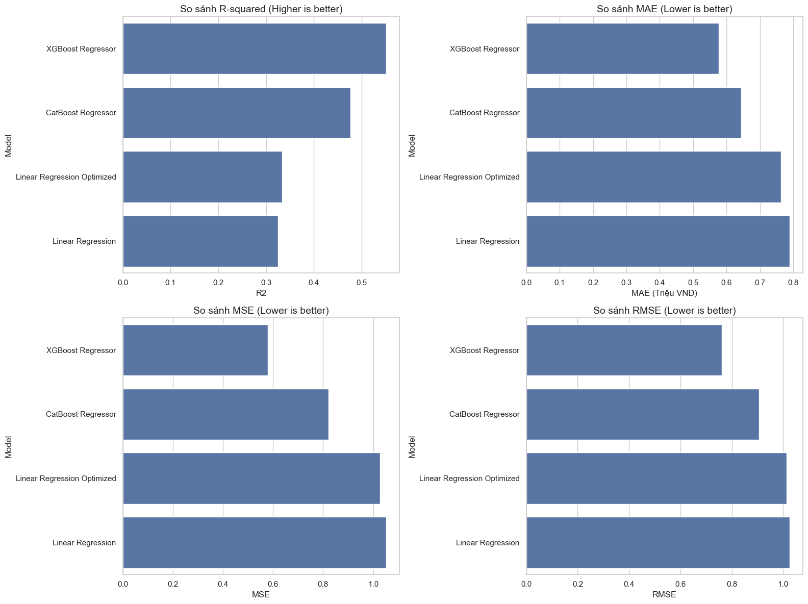

# Đồ Án Nhập môn Khoa học Dữ liệu

**Môn học:** Nhập môn Khoa học Dữ liệu  
**Giảng viên Hướng dẫn:** Thầy Lê Nhựt Nam, Cô Võ Nam Thục Đoan  
**Nhóm:** 10  
 
|Họ và Tên|MSSV|
|---|---|
| Nguyễn Hữu Khánh Hưng|	23120271|
|Phạm Quốc Khánh|23120283|
|Châu Huỳnh Phúc|	23120329|
|Vũ Trần Phúc| 23120333|

## Công nghệ 


## Mô tả đồ án
Đồ án tập trung vào việc phân tích và dự đoán giá phòng trọ tại TP.HCM dựa trên dữ liệu crawl từ phongtro123.com.

### Thông số
Nhóm thu thập > 20.000 records với > 10 features, cụ thể:
- Số dòng: 24122
- Số cột: 17
- Dung lượng: 4.3 MB
- Danh sách features gồm:
`title`,address,price,area,noithat,gac,kebep,maylanh,maygiat,tulanh,thangmay,chungchu,giotu,hamxe,ngaydang,thongtinmota,url
## Cài đặt  
### Yêu cầu
- Python 3.10+
- Google Gemini API key
- Jupyter Notebook / JupyterLab

### Hướng dẫn cài đặt
1. Clone repository
```bash
# Clone repository
git clone https://github.com/HungHiHung10/Intro2DS.git
cd Intro2DS
```
2. Khởi tạo virtual environment

_Khuyến nghị sử dụng `venv` hoặc `conda` để quản lý môi trường ảo._
```bash
conda create -n intro2ds python=3.10
conda activate intro2ds
```
1. Cài đặt dependencies
```bash
pip install -r requirements.txt
```
1. Chạy các notebooks theo thứ tự(trong thư mục `notebooks/`)
```bash
jupyter notebook notebooks/
```
## Cấu trúc thư mục

```text
Intro2DS
│   .gitignore             
│   LICENSE                # Giấy phép MIT
│   README.md              
│   requirements.txt       
│   
├───Data                  
│    ├──   raw.csv         # Dữ liệu thô merge từ tất cả các page crawl
│    ├──   cleaned.csv     # Dữ liệu đã làm sạch cơ bản (loại bỏ duplicates, convert type)
│    ├──   processed.csv   # Dữ liệu cuối cùng sau preprocessing đầy đủ (dùng cho EDA & Modeling)
│    ├──   Page1to300.csv  # Dữ liệu crawl từ trang 1–300
│    ├──   Page301to600.csv # Trang 301–600
│    ├──   Page601to900.csv # Trang 601–900
│    └──   Page901to1200.csv # Trang 901–1200
├───assets                 # Hình ảnh, biểu đồ minh họa trong báo cáo và notebook
│
├───notebooks              # Các Jupyter Notebook theo quy trình đồ án
│    ├──   images/         # Thư mục lưu ảnh visualize (heatmap, distribution, feature importance...)
│    ├──   CrawlData.ipynb # Notebook crawl dữ liệu từ phongtro123.com
│    ├──   ProcessingData.ipynb # Xử lý dữ liệu thô, merge file, clean cơ bản
│    ├──   Pre_Processing.ipynb # Tiền xử lý nâng cao (regex, missing values, feature engineering)
│    ├──   EDA.ipynb       # Khám phá dữ liệu (phân bố, correlation, outliers)
│    ├──   Analysis.ipynb  # Trả lời 5 câu hỏi nghiên cứu + visualize insights
│    ├──   Modeling.ipynb  # Xây dựng, tuning và đánh giá mô hình (Linear, XGBoost, CatBoost)
│    └──   Bonus_Extension.ipynb # Phần mở rộng (Gemini check tiện ích qua ảnh - amenities verification)
│
└───utilities              # Các module Python hỗ trợ (code tái sử dụng)
    ├──   analysis.py      # Hàm phân tích dữ liệu, tính toán metrics
    ├──   explore_data.py  # Hàm EDA (plot distribution, correlation heatmap...)
    ├──   modeling.py      # Hàm xây dựng và tuning mô hình (train XGBoost, CatBoost...)
    ├──   processing.py    # Hàm preprocessing (clean text, handle missing, regex...)
    └──   visualize.py     # Hàm vẽ biểu đồ (barplot, boxplot, scatter...)
                   
```

## Quy trình & Notebook chính
Đây là mô tả chi tiết quy trình xử lý dữ liệu thông qua hệ thống các Jupyter Notebooks, được ánh xạ khớp với cấu trúc thư mục và lộ trình (timeline) đồ án mà nhóm đã thực hiện. Quy trình này tuân thủ chặt chẽ mô hình **CRISP-DM** (Cross-Industry Standard Process for Data Mining).

### 1. Thu thập dữ liệu (Data Collection)

* **Notebook:** `CrawlData.ipynb`
* **Giai đoạn tương ứng:** Giai đoạn 2 (04/11 - 08/11/2025).
* **Chi tiết quy trình:**
  * **Mục tiêu:** Tự động hóa việc thu thập dữ liệu từ website mục tiêu là `phongtro123.com`.
  * **Thực hiện:**
    * Sử dụng thư viện crawl (như Selenium/BeautifulSoup) để duyệt qua các trang danh sách phòng trọ.
    * Phân chia tác vụ crawl theo từng khoảng trang (ví dụ: Page 1-300, 301-600...) để chia tải cho các thành viên và tránh bị chặn IP.
    * **Trích xuất đặc trưng (Features):** Thu thập các trường thông tin thô bao gồm: Tiêu đề (Title), Địa chỉ, Giá (Price), Diện tích (Area), Ngày đăng, Tiện ích (Claimed Amenities), Mô tả chi tiết và URL bài đăng.


  * **Đầu ra:** Các file dữ liệu thành phần `Page1to300.csv`, `Page301to600.csv`... và file tổng hợp `raw.csv` nằm trong thư mục `Data/`.


### 2. Sơ chế & Làm sạch dữ liệu (Data Cleaning & Preprocessing)

* **Notebooks:** `ProcessingData.ipynb` (Sơ chế) và `Pre_Processing.ipynb` (Nâng cao).
* **Giai đoạn tương ứng:** Giai đoạn 3 (08/11 - 20/11/2025) và một phần Giai đoạn 5.
* **Chi tiết quy trình:**
  * **Giai đoạn Sơ chế (`ProcessingData.ipynb`):**
    * Hợp nhất (Merge) các file CSV thành phần thành một bộ dữ liệu duy nhất.
    * Xử lý các dòng dữ liệu trùng lặp (Duplicates) để đảm bảo tính duy nhất của tin đăng.
    * Loại bỏ các dòng rỗng (Empty rows) hoặc thiếu dữ liệu quá nhiều không thể cứu vãn.


  * **Giai đoạn Tiền xử lý chuyên sâu (`Pre_Processing.ipynb`):**
    * **Convert Data Types:** Chuyển đổi cột `Price` và `Area` từ dạng text sang dạng số thực (Float) để máy tính hiểu được.
    * **Regex Extraction:** Sử dụng Regular Expressions để trích xuất thông tin quan trọng bị ẩn trong văn bản mô tả (ví dụ: tách quận/huyện từ địa chỉ, tách số điện thoại...).
    * **Handling Categorical Data:** Xử lý các lỗi chính tả, đồng bộ hóa các từ đồng nghĩa (synonyms) và nhóm các danh mục hiếm (rare categories).


  * **Đầu ra:** File `Data/processed.csv` sạch sẽ, sẵn sàng cho việc phân tích và đưa vào mô hình.


### 3. Khám phá dữ liệu & Phân tích chuyên sâu (EDA & Analysis)

* **Notebooks:** `EDA.ipynb` và `Analysis.ipynb`.
* **Giai đoạn tương ứng:** Giai đoạn 4 (24/11 - 04/12/2025) và Giai đoạn 5.
* **Chi tiết quy trình:**
  * **Khám phá (`EDA.ipynb`):**
    * Thực hiện thống kê mô tả (Descriptive Statistics) để hiểu phân bố của Giá và Diện tích.
    * Vẽ biểu đồ Heatmap để xem xét mối tương quan (Correlation) giữa các biến số (ví dụ: Diện tích tăng thì Giá có tăng tuyến tính không?).
    * Phát hiện các giá trị ngoại lai (Outliers) – ví dụ: phòng trọ giá 200k hoặc 50 triệu/tháng.


    * **Phân tích câu hỏi nghiên cứu (`Analysis.ipynb`):**
    * Trả lời 5 câu hỏi ý nghĩa (Meaningful Questions) đã đặt ra ở Giai đoạn 5.
    * Trực quan hóa (Visualize) các Insight tìm được để đưa vào báo cáo.


  * **Đầu ra:** Insights chi tiết về dữ liệu và các biểu đồ minh họa.


### 4. Xây dựng mô hình (Modeling & Evaluation)

* **Notebook:** `Modeling.ipynb`
* **Giai đoạn tương ứng:** Giai đoạn 5 và 6 (05/12/2025 - 13/01/2026).
* **Chi tiết quy trình:**
  * **Feature Engineering:** Chuẩn bị dữ liệu đầu vào, chia tập Train/Test/Validation.
  * **Lựa chọn mô hình:** Thử nghiệm các thuật toán Regression như **Linear Regression, XGBoost, CatBoost**.
  * **Hyperparameter Tuning:** Tinh chỉnh tham số để mô hình đạt hiệu suất cao nhất (Tối ưu hóa RMSE, MAE).
  * **Đánh giá (Evaluation):** So sánh hiệu quả giữa các mô hình và chọn ra mô hình tốt nhất để dự đoán giá phòng trọ.
  * **Lưu trữ:** Lưu model tốt nhất để có thể tái sử dụng.

  * **Đầu ra:** Mô hình dự đoán giá phòng trọ với hiệu suất tối ưu.
  

### Phần mở rộng - Kiểm chứng tiện ích thông minh (Amenities Verification)

* **Notebook:** `Bonus_Extension.ipynb`
* **Điểm nhấn công nghệ:** Sử dụng **Gemini 2.5 Flash** (Multimodal AI).
* **Giai đoạn tương ứng:** Giai đoạn 6 (10/01 - 13/01/2026).
* **Chi tiết quy trình:**
  * **Vấn đề:** Các chủ trọ thường tích chọn "Có đủ tiện ích" (Claim) nhưng thực tế trong ảnh không có.
  * **Giải pháp:**
    1. Lấy URL ảnh từ dữ liệu đã crawl.
    2. Gửi ảnh và danh sách tiện ích cần kiểm tra (ví dụ: máy lạnh, gác, kệ bếp) đến API của Gemini 2.5 Flash.
    3. AI phân tích hình ảnh và trả về kết quả đối chiếu: **ĐỦ** hoặc **THIẾU** kèm lý do chi tiết.
    4. So sánh kết quả AI với thông tin chủ trọ khai báo để đánh giá độ chính xác của dữ liệu tiện ích.

  * **Mục đích:** Giúp người thuê nhà có cái nhìn chính xác hơn về tiện ích thực tế của phòng trọ, từ đó nâng cao độ tin cậy của dữ liệu.

  * **Đầu ra:** Báo cáo kiểm chứng tiện ích với tỷ lệ chính xác và các ví dụ minh họa.

_**Kết luận:**_
Quy trình này đảm bảo tính khoa học, từ dữ liệu thô (Raw) đến tri thức (Insight) và cuối cùng là giải pháp (Model), khớp hoàn toàn với cấu trúc thư mục Github mà nhóm đã tổ chức.


## Phân công công việc (Tóm tắt)

| STT | Thành viên                | MSSV     | Nhiệm vụ chính                                                                    | Đóng góp |
| --- | ------------------------- | -------- | --------------------------------------------------------------------------------- | -------- |
| 1   | **Nguyễn Hữu Khánh Hưng** | 23120271 | Crawl data, Baseline Linear Regression, Hyperparameter tuning, Merge code, README | **100%** |
| 2   | **Phạm Quốc Khánh**       | 23120283 | Crawl data, XGBoost, Phân tích địa lý & tiện nghi (Câu 1,2), Báo cáo              | **100%** |
| 3   | **Châu Huỳnh Phúc**       | 23120329 | Feature Engineering, Correlation, Mùa vụ (Câu 5), Quản lý tiến độ                 | **100%** |
| 4   | **Vũ Trần Phúc**          | 23120333 | Word-embedding, CatBoost, Biến động giá & vị trí (Câu 3,4), Báo cáo tổng kết      | **100%** |

Bạn có thể copy đoạn Markdown này vào file `README.md` hoặc báo cáo của bạn nhé.


## Kết quả & So sánh mô hình
### So sánh mô hình dự đoán giá phòng trọ

### Bảng kết quả mô hình dự đoán giá phòng trọ
| Model                       | R²     | MAE (Triệu VND) | MSE    | RMSE   |
| --------------------------- | ------ | --------------- | ------ | ------ |
| XGBoost Regressor           | **0.5518** | **0.5763**          | **0.5786** | **0.7607** |
| CatBoost Regressor          | 0.4769 | 0.6438          | 0.8210 | 0.9061 |
| Linear Regression Optimized | 0.3337 | 0.7630          | 1.0283 | 1.0140 |
| Linear Regression           | 0.3251 | 0.7894          | 1.0523 | 1.0258 |

**Nhận xét:**
- **XGBoost** là mô hình tốt nhất với R² cao nhất (0.5035) và lỗi tuyệt đối nhỏ nhất (MAE ~613k VND, RMSE ~801k VND).
- **CatBoost** xếp thứ 2, vẫn vượt trội hơn các phiên bản Linear Regression.
- **Linear Regression Optimized (ElasticNet)** cải thiện rõ rệt so với baseline (tăng R² từ 0.321 → 0.333), nhưng vẫn kém xa các mô hình boosting.
- **Kết luận:** XGBoost là lựa chọn tối ưu cho bài toán dự đoán giá phòng trọ trong đồ án này.

## License
MIT License - Phục vụ mục đích học tập & nghiên cứu.